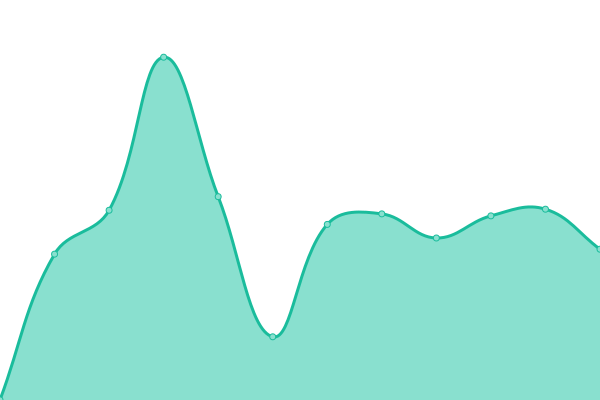

# [📈 Live Status](https://jluislopez5683.github.io/status): <!--live status--> **🟧 Partial outage**

This repository contains the open-source uptime monitor and status page for [jluislopez5683](https://jluislopez5683.github.io/status), powered by [Upptime](https://github.com/upptime/upptime).

With [Upptime](https://upptime.js.org), you can get your own unlimited and free uptime monitor and status page, powered entirely by a GitHub repository. We use [Issues](https://github.com/jluislopez5683/status/issues) as incident reports, [Actions](https://github.com/jluislopez5683/status/actions) as uptime monitors, and [Pages](https://jluislopez5683.github.io/status) for the status page.

<!--start: status pages-->
<!-- This summary is generated by Upptime (https://github.com/upptime/upptime) -->
<!-- Do not edit this manually, your changes will be overwritten -->
<!-- prettier-ignore -->
| URL | Status | History | Response Time | Uptime |
| --- | ------ | ------- | ------------- | ------ |
|  [Lopezcode](https://lopezcode.com) | 🟩 Up | [lopezcode.yml](https://github.com/jluislopez5683/status/commits/HEAD/history/lopezcode.yml) | 

 214ms
     
 | 

<a href="https://jluislopez5683.github.io/status/history/lopezcode">100.00%</a>
    

|  [Audicomer](https://audicomer.com.ec) | 🟩 Up | [audicomer.yml](https://github.com/jluislopez5683/status/commits/HEAD/history/audicomer.yml) | 

 4707ms
     
 | 

<a href="https://jluislopez5683.github.io/status/history/audicomer">100.00%</a>
    

|  [Audicomer APP](https://audi-tracking.com) | 🟩 Up | [audicomer-app.yml](https://github.com/jluislopez5683/status/commits/HEAD/history/audicomer-app.yml) | 

 184ms
     
 | 

<a href="https://jluislopez5683.github.io/status/history/audicomer-app">100.00%</a>
    

|  [Itylogistics](https://itylogistics.com) | 🟥 Down | [itylogistics.yml](https://github.com/jluislopez5683/status/commits/HEAD/history/itylogistics.yml) | 

 588ms
     
 | 

<a href="https://jluislopez5683.github.io/status/history/itylogistics">0.00%</a>
    

<!--end: status pages-->

[**Visit our status website →**](https://jluislopez5683.github.io/status)

## 📄 License

- Powered by: [Upptime](https://github.com/upptime/upptime)
- Code: [MIT](./LICENSE) © [jluislopez5683](https://jluislopez5683.github.io/status)
- Data in the `./history` directory: [Open Database License](https://opendatacommons.org/licenses/odbl/1-0/)
